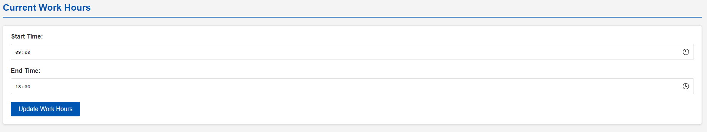
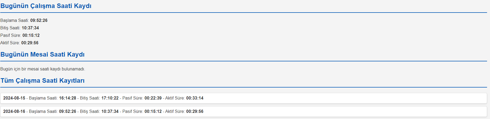

# Screen Activity Tracker for Work and Overtime Monitoring

This Java-based application is designed to monitor and log screen activity and inactivity for employees. It tracks active and passive times during working hours and overtime, providing detailed records of start and end times, as well as total active and passive durations. The system includes a user-configurable work hour setting and an intuitive Thymeleaf-based UI.

## Features

- **Work Hour Tracking**: Tracks start and end times during work hours, calculates active and passive durations.
- **Overtime Tracking**: Logs time spent working outside of regular hours, differentiating between work hours and overtime.
- **Customizable Work Hours**: Users can set and update their work hours according to their schedule.
- **Intuitive UI**: A user-friendly interface built with Thymeleaf, allowing easy interaction with the system.
- **Automatic Inactivity Detection**: Detects periods of inactivity (e.g., 5 minutes of no input) and logs them as passive time.

## Screenshots

### Main Interface


### Work Hour Settings


### Daily Activity Log


## Getting Started

### Prerequisites

- Java 11 or higher
- MySQL database
- Maven

### Installation

1. Clone the repository:
   ```bash
   git clone https://github.com/your-username/screen-activity-tracker.git
   ```
2. Navigate to the project directory:
   ```bash
   cd screen-activity-tracker
   ```
3. Configure the MySQL database connection in `application.properties`.
4. Build the project:
   ```bash
   mvn clean install
   ```
5. Run the application:
   ```bash
   mvn spring-boot:run
   ```

### Usage
- **Go to the UI**: Search in your local browser "localhost:8080/screen-tracker"
- **Start the Listener**: If status is stopped Click "Start Listener" to begin tracking activity.
- **Stop the Listener**: Click "Stop Listener" to stop tracking.
- **Set Work Hours**: Update work hours through the settings interface.

## Contributing

Contributions are welcome! Please fork this repository and submit a pull request with your changes.

## License

This project is licensed under the MIT License - see the [LICENSE](LICENSE) file for details.
